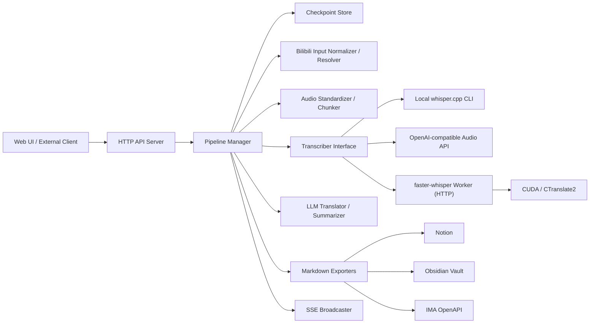
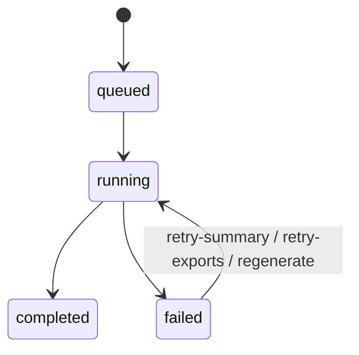
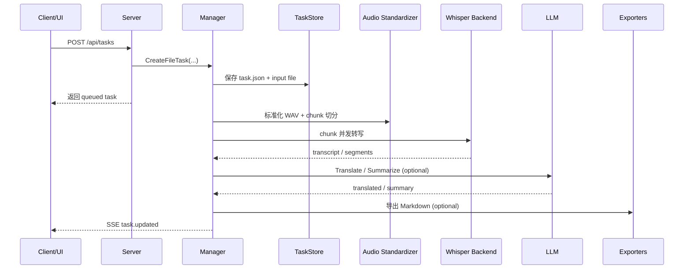
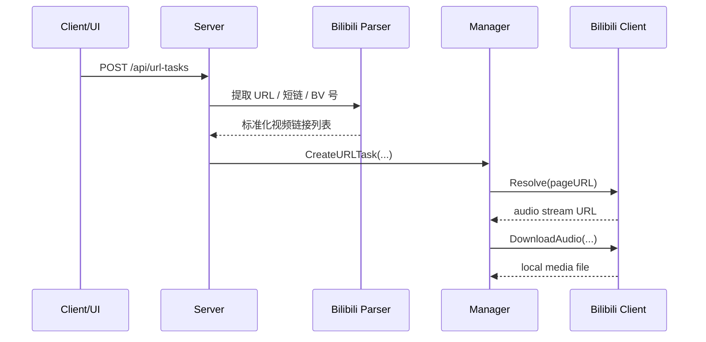
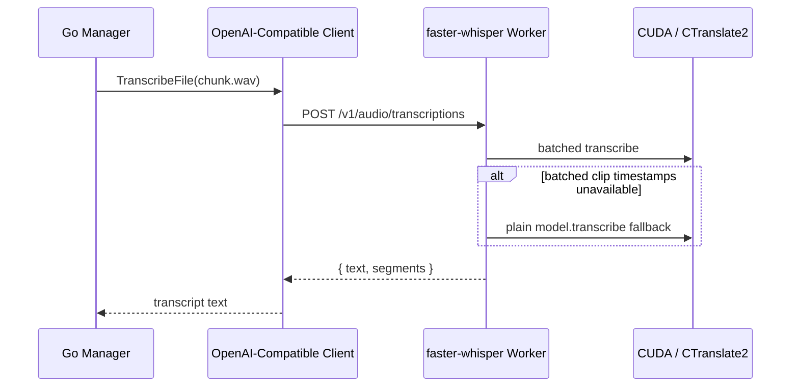

# 架构文档

## 1. 目标

本项目是一个基于 Go 的音视频转写服务，当前围绕以下能力组织：

- 本地音视频文件批量转写
- 哔哩哔哩链接、短链、BV 号批量识别与转写
- `faster-whisper` 常驻 GPU worker / 本地 `whisper` / OpenAI Whisper 兼容后端
- LLM 翻译与 Markdown 总结
- 任务队列、块级断点续跑、总结失败重试
- Markdown 自动导入 Notion、Obsidian、IMA
- 任务阶段、保存结果、导出结果、耗时指标的实时展示

项目当前是一个“单进程 Go Web 服务 + 本地任务队列 + 可选 Python GPU worker”的结构，适合桌面端、本机部署或轻量服务部署。

## 2. 总体架构



## 3. 模块划分

### 3.1 启动层

入口文件：`cmd/subtitle-whisper/main.go`

职责：

- 加载 `.env`
- 读取环境变量配置
- 初始化 HTTP Server
- 注册路由与静态页面
- 处理优雅退出

### 3.2 配置层

核心文件：`internal/config/config.go`

职责：

- 从环境变量加载转写、LLM、队列、导出、B 站配置
- 提供默认值
- 屏蔽本地模式、远端模式、`faster-whisper` 模式的配置差异

关键配置分组：

- Whisper 通用：`WHISPER_*`
- faster-whisper worker：`WHISPER_FASTER_*`
- 本地 whisper：`WHISPER_LOCAL_*`
- LLM：`LLM_*`
- 队列 / 断点续跑：`TASK_WORKERS`、`CHECKPOINT_DIR`、`CHUNK_SECONDS`、`CHUNK_PARALLELISM`
- 输出：`AUTO_SAVE_RESULTS`、`OUTPUT_DIR`
- B 站：`BILIBILI_*`
- 导出：`NOTION_*`、`OBSIDIAN_*`、`IMA_OPENAPI_*`

### 3.3 接口层

核心文件：`internal/app/server.go`

职责：

- 提供 HTTP API
- 处理文件上传和 URL / BV 号文本提交
- 提供任务查询、重试总结、重试导出、SSE 推送
- 托管前端页面

当前 API：

- `POST /api/tasks`：提交本地文件任务
- `POST /api/url-tasks`：提交 B 站 URL / BV 号任务
- `GET /api/tasks`：任务列表
- `GET /api/tasks/{id}`：任务详情
- `GET /callback/tasks/{id}`：轻量状态查询
- `POST /api/tasks/{id}/generate-summary`：为已有 transcript 生成总结
- `POST /api/tasks/{id}/retry-summary`：重试总结
- `POST /api/tasks/{id}/retry-exports`：重试导出
- `GET /api/events`：SSE 实时事件
- `GET /api/health`：健康检查与运行状态

### 3.4 领域模型层

核心文件：`internal/domain/models.go`

职责：

- 定义任务、分段、导出结果、事件模型
- 统一前后端、checkpoint 和恢复逻辑的数据结构

关键对象：

- `Task`
- `Segment`
- `ExportResult`
- `TaskMetrics`
- `Event`

`Task` 当前同时承载：

- 基础状态：`queued / running / completed / failed`
- 任务来源：`file / url`
- 文本结果：转写、翻译、总结
- 断点状态：`TotalChunks`、`CompletedChunks`、`CheckpointDir`
- 输出结果：保存文件、导出状态
- 性能指标：音频标准化耗时、翻译耗时、总结耗时、LLM 总耗时

### 3.5 任务编排层

核心文件：`internal/pipeline/manager.go`

这是项目的核心调度器，负责把不同来源的输入组织成统一流水线。

职责：

- 创建文件任务和 URL 任务
- 启动 worker 消费任务队列
- 从 checkpoint 恢复未完成任务
- 执行 URL 解析、下载、转写、翻译、总结、导出
- 控制任务状态、进度和耗时指标
- 推送 SSE 事件

统一任务流程：

1. 创建任务
2. 写入 checkpoint 目录
3. 进入队列
4. worker 执行
5. 更新任务状态 / 进度 / metrics
6. 保存中间结果
7. 推送 SSE 事件

### 3.6 检查点存储层

核心文件：

- `internal/pipeline/store.go`
- `internal/pipeline/chunks.go`

职责：

- 为每个任务创建独立目录
- 持久化 `task.json`
- 保存原始输入文件、标准 WAV、转写文本、分段和 chunk 级 checkpoint
- 支持服务重启后的任务恢复

典型目录结构：

```text
outputs/_checkpoints/
  taskxxxxxx/
    task.json
    input.mp4
    input.standard.wav
    transcript.txt
    segments.json
    chunks/
      chunk-0000.json
      chunk-0001.json
      chunk-0002.json
```

chunk checkpoint 当前记录：

- chunk 索引
- 起止时间
- 状态：`pending / running / done / failed`
- 文本结果
- 错误信息
- 更新时间

### 3.7 输入源解析层

核心文件：`internal/source/bilibili.go`

职责：

- 规范化 B 站输入
- 从原始文本中提取完整链接、短链和 `BV` 号
- 将裸 `BV` 号自动拼成标准视频链接
- 拉取页面 HTML
- 从页面 `__playinfo__` 中提取音频流
- 下载音频到 checkpoint 目录

当前输入策略：

- 支持 `https://www.bilibili.com/video/BV...`
- 支持 `b23.tv/...`
- 支持裸 `BV...`
- 支持一段混合文本里包含多个链接 / BV 号
- 自动去重后再创建任务

### 3.8 转写层

相关文件：

- `internal/transcribe/local.go`
- `internal/transcribe/openai.go`
- `internal/service/interfaces.go`
- `scripts/faster_whisper_worker.py`

职责：

- 屏蔽不同 Whisper 后端的调用差异
- 向上层暴露统一 `Transcriber` / `ProgressTranscriber` 接口

当前支持：

- 本地 `whisper` 命令行
- OpenAI 兼容音频转写接口
- 本地 `faster-whisper` 常驻 worker

#### 3.8.1 本地 whisper 模式

特点：

- 通过外部进程调用
- 支持进度解析
- 非 WAV 文件会先经 `ffmpeg` 标准化
- 更适合 CPU 或小规模本地实验

#### 3.8.2 OpenAI 兼容接口模式

特点：

- 使用统一 multipart 请求调用 `/v1/audio/transcriptions`
- 可接 OpenAI 官方或兼容实现
- 便于接远端托管后端

#### 3.8.3 faster-whisper worker 模式

相关文件：`scripts/faster_whisper_worker.py`

特点：

- Python 常驻进程
- `WhisperModel + BatchedInferencePipeline`
- 优先走 batched GPU 路径
- 对低语音密度 chunk 做 fallback，避免 clip timestamps 问题导致整块失败
- 对 Go 侧暴露 OpenAI 兼容接口：
  - `GET /health`
  - `POST /v1/audio/transcriptions`

这样 Go 侧无需理解 GPU 细节，只需按兼容接口发送 chunk。

### 3.9 音频处理层

相关文件：

- `internal/audio/wav.go`
- `internal/pipeline/manager.go`

职责：

- 将音频统一成 16kHz、单声道、PCM16 WAV
- 把长音频拆分为多个分块
- 支持 chunk 级断点续跑
- 支持单任务内 chunk 并发

为什么要统一成 WAV：

- 便于切块
- 便于跨后端保持稳定行为
- 便于恢复处理

为什么要 chunk 并发：

- 大多数场景全局任务数不高，瓶颈在单任务长音频
- 单任务内并发可以更快喂给 OpenAI / faster-whisper
- 结合 chunk checkpoint 可以只补跑失败块

### 3.10 LLM 层

核心文件：`internal/llm/openai.go`

职责：

- 调用 OpenAI 兼容 Chat Completions 接口
- 提供翻译与总结能力

当前语义：

- 翻译：输出简体中文
- 总结：输出 Markdown 文档

### 3.11 导出层

相关文件：

- `internal/exporter/notion.go`
- `internal/exporter/obsidian.go`
- `internal/exporter/ima.go`

职责：

- 在总结成功后，把 Markdown 发往外部系统
- 将成功或失败状态回写到任务对象

当前支持：

- Notion：在指定父页面下创建子页面
- Obsidian：将 Markdown 写入 Vault 指定目录
- IMA：通过 OpenAPI `import_doc` 创建新笔记

### 3.12 前端层

相关文件：

- `internal/app/web/index.html`
- `internal/app/web/app.js`
- `internal/app/web/styles.css`

职责：

- 提供本地文件和 URL 两种提交入口
- 展示任务列表、进度、阶段、错误、保存文件、导出状态
- 展示任务耗时指标
- 通过 SSE 实时刷新任务状态

## 4. 任务生命周期

### 4.1 状态流转



说明：

- `queued`：已创建，等待 worker
- `running`：任务处理中
- `completed`：全部流程完成
- `failed`：任务失败
- `summary_failed` 是 `Stage`，不是单独的 `Status`

### 4.2 常见阶段

任务 `Stage` 可能包括：

- `queued`
- `preparing`
- `resolving_url`
- `downloading_media`
- `transcribing`
- `translating`
- `summarizing`
- `uploading`
- `saving`
- `completed`
- `failed`
- `summary_failed`

## 5. 关键调用流程

### 5.1 本地文件任务调用流程



### 5.2 B 站 URL / BV 输入流程



### 5.3 faster-whisper worker 调用流程



### 5.4 总结失败重试流程

```mermaid
sequenceDiagram
    participant Client as Client/UI
    participant API as Server
    participant Manager as Manager
    participant LLM as LLM

    Client->>API: POST /api/tasks/{id}/retry-summary
    API->>Manager: RetrySummary(id)
    Manager->>LLM: Summarize(transcript or translatedText)
    LLM-->>Manager: summary
    Manager-->>Client: SSE task.updated
```



## 6. 断点续跑机制

当前实现是“chunk 级断点续跑 + 单任务并发”。

处理逻辑：

1. 输入文件先落到 checkpoint 目录
2. 转成标准 WAV
3. 按 `CHUNK_SECONDS` 切块
4. 为每个 chunk 写独立 checkpoint
5. 已完成 chunk 会聚合回：
   - `task.json`
   - `transcript.txt`
   - `segments.json`
6. 服务重启时扫描 checkpoint 目录恢复任务
7. 未完成 chunk 重新入队执行

相较旧版“只靠 `CompletedChunks`”的方案，新版优势是：

- 可以表达离散 chunk 状态
- 更适合 chunk 并发
- 某个块失败时更容易局部补跑
- 兼容旧 checkpoint 目录迁移

## 7. 指标与可观测性

任务对象当前记录以下耗时指标：

- `AudioConvertDurationMs`：音频转标准 WAV 耗时
- `TranslationDurationMs`：LLM 翻译耗时
- `SummaryDurationMs`：LLM 总结耗时
- `LLMTotalDurationMs`：LLM 总调用耗时

这些指标会：

- 写入 `task.json`
- 出现在任务详情 API 中
- 通过 SSE 推送到前端
- 在 Web UI 的 `Timing Metrics` 区块展示

## 8. 输出与导出策略

### 8.1 本地输出

在 `OUTPUT_DIR` 下保存：

- `*.transcript.txt`
- `*.translated.txt`
- `*.summary.md`

说明：

- 转写和翻译文件受 `AUTO_SAVE_RESULTS` 控制
- 只要有总结内容，`.summary.md` 会生成并参与导出

### 8.2 Notion 导出

触发条件：

- 有 `summary`
- 配置了 `NOTION_TOKEN`
- 配置了 `NOTION_PARENT_PAGE_ID`

### 8.3 Obsidian 导出

触发条件：

- 有 `summary`
- 配置了 `OBSIDIAN_VAULT_DIR`

### 8.4 IMA 导出

触发条件：

- 有 `summary`
- 配置了 `IMA_OPENAPI_CLIENTID`
- 配置了 `IMA_OPENAPI_APIKEY`

## 9. 关键设计选择

### 9.1 为什么统一成一个 Manager

这样文件任务和 URL 任务可以共享：

- 队列
- checkpoint 恢复
- 进度事件
- 翻译总结逻辑
- 自动保存与导出

### 9.2 为什么采用“Go 管任务 + Python 管 GPU”

原因：

- Go 更适合做服务编排、checkpoint、导出和状态管理
- `faster-whisper` / CTranslate2 更适合在 Python 进程中常驻 GPU 模型
- 两者通过 OpenAI 兼容接口解耦，边界清晰

### 9.3 为什么采用单任务 chunk 并发而不是只加全局 worker

当前典型场景是：

- 同时任务数不多
- 单个长音频更容易成为瓶颈

因此优先提升“单任务吞吐量”比盲目增加全局队列并发更有效。

### 9.4 为什么输入阶段就规范化 BV 号

这样可以：

- 减少前端输入约束
- 提高批量导入体验
- 保证后续 URL 解析层始终面对统一链接格式

## 10. 已知边界

- 当前 B 站解析依赖公开页面中的 `__playinfo__`
- 登录态、风控、地区限制内容可能无法解析
- `faster-whisper` worker 当前由用户手动启动，不由 Go 服务自动托管
- chunk 边界尚未引入 overlap 去重，句子可能在分块边缘被切断
- 任务队列当前在单进程内，暂未设计分布式 worker
- Web 前端当前主要面向本地运维和人工操作，不是精细 BI 面板

## 11. 建议的后续演进

- 为 B 站补充 cookie / 登录态支持
- 为音频分块加入 overlap 与边界去重
- 增加媒体下载耗时、转写耗时等更多任务指标
- 将 `faster-whisper` worker 改为自动拉起 / 自动探活
- 增加任务取消能力
- 增加 URL 任务幂等去重
- 增加更细粒度的分块结果导出
- 为外部调用补充更稳定的 webhook / callback 机制
